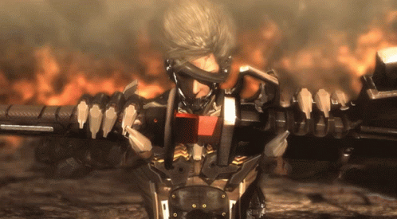

  

#  Ahmed Elwakil 

  <b>Arch</b> &nbsp;<code>[@DeletedArch]</code> &nbsp;•&nbsp; 
  <b>Technical Game Designer</b> &nbsp;•&nbsp; 
  <b>Combat & Physics Systems</b>

 

 -UNITY-000000?style=for-the-badge&logo=unity&logoColor=white)

  

> *"Building combat engines with sky-high skill ceilings and zero tolerance for sluggishness."*

---

<table>
  <tr>
    <td width="30%" align="center" valign="middle">
      
    </td>
    <td width="70%" valign="top">
      <h3> Combat Philosophy & DNA</h3>
      

        Deeply rooted in the <b>Character Action & Hack 'n Slash</b> tradition. Driven by the pursuit of expressive combat freedom, razor-sharp responsiveness, and high-skill gameplay ceilings.
      

      <ul>
        <li><b>Core Inspirations:</b> <i>Ninja Gaiden</i>, <i>Metal Gear Rising: Revengeance</i>, and <i>Devil May Cry</i>.</li>
        <li><b>Combat Anatomy & Study:</b> Constantly breaking down and deconstructing combat mechanics—from cancel priority trees and input buffering to hitstop micro-pauses, juggle kinematics, and enemy aggression pacing.</li>
        <li><b>Design Mission:</b> Engineering tight, tactile gameplay feel where mechanical depth and cinematic impact seamlessly collide.</li>
      </ul>
    </td>
  </tr>
</table>

---

###  Core Specializations & Subsystems

####  Combat & Action Architecture
- **Frame-Advantage & Cancel Trees**: Responsive hit-confirm windows, dodge-cancels, and priority-based interrupt channels.
- **Deterministic Input Buffering**: Reliable input queueing and action buffering to eliminate dead-input feel.
- **Hitbox & Collision Pipelines**: Precise hitbox/hurtbox queries supporting clashing, deflection, and parry detection.
- **Juggle & Launch Kinematics**: Directional launch vectors, wall-bounces, and custom juggle decay gravity.

####  Physics & Motion Systems
- **Kinematic Character Controllers**: Custom non-capsule, ray/sweep-based movement solvers for precise collision handling.
- **Momentum & Air-Control Curves**: Responsive acceleration, air braking, and velocity preservation through state changes.
- **Impact Dynamics & Hitstop**: Micro-frame freezes, screen trauma triggers, and directional impulse resolution.
- **Animation Blending & Weight**: Motion-matching integration and weight simulation for heavy impacts.

####  Technical Design & Tooling
- **In-Engine Curve & Attack Editors**: Custom editor extensions for tuning attack windows and movement curves.
- **Visual Debuggers**: Real-time overlays for active hitboxes, spatial queries, and frame-advantage tracking.
- **Data-Driven Design Systems**: Modular balancing structures for rapid weapon and enemy archetype iteration.

---

###  Technical Stack & Tooling

| Domain | Technologies & Frameworks |
| :--- | :--- |
| **Engines** | `Unity` (C#) |
| **Languages** | `C#`, `Python`, `Lua/Luau` |
| **Physics & Math** | `Linear Algebra / Vector Math`, `Quaternions`, `CFrames` |
| **Tooling & Profiling** | `Visual Studio`, `Git` |

---

###  Featured Mechanics & Systems

<table>
  <tr>
    <td width="100%">
      <h3 align="center"> Combat & Combo Framework</h3>
      
Decoupled, event-driven combat architecture featuring input buffer windows, hit-pause micro-delays, cancel trees, and animation blending based on attack direction and velocity.

      

        <code>State Machines</code> <code>Hitstop</code> <code>Input Buffering</code>
      

    </td>
  </tr>
</table>

---

###  Design Principles & System Philosophy

- **Deterministic & Responsive**: Generous input buffering paired with strict, responsive state transitions.
- **Impactful Feedback & Juice**: Hitstop, directional screen shake, dynamic camera lag, and particle impulse synced tightly to impact frames.
- **Designer Ergonomics**: Modular, data-driven attack profiles allowing fast iteration on frame data and hit-reactions without hardcoded values.

---

